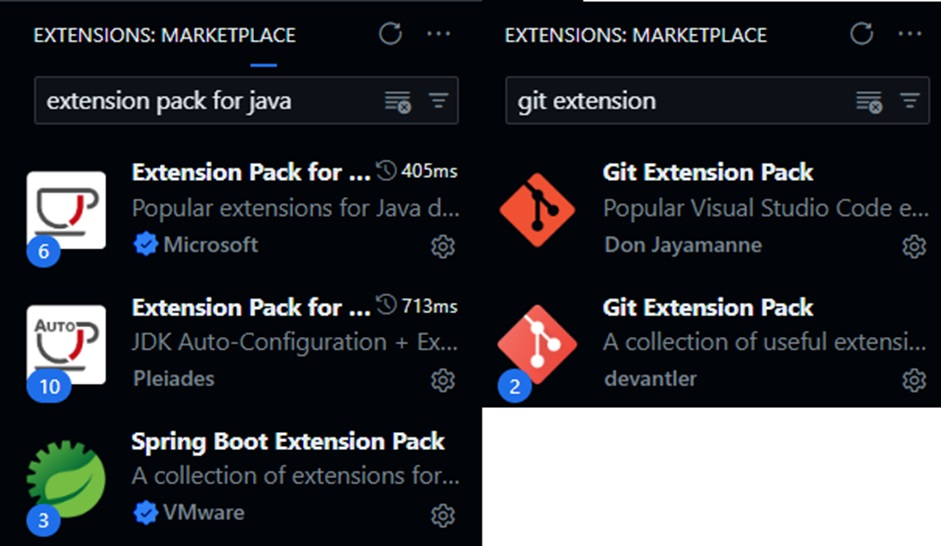

# Mapa Tópicos em Computação II

- Já trabalho como desenvolvedor faz algum tempo, portanto não precisei instalar os programas e nem as extensões para o Visual Studio Code.
- No print abaixo estou criando uma pasta para o projeto com o nome “Mapa-Topicos” e abrindo a mesma no VS Code;
- Logo abaixo estou demonstrando também que o Git já estava configurado na minha máquina:
  
  
- Criando programa Java, depois compilando e executando:
  
- Criando o primeiro commit:
  
- Criando repositório no GitHub:
  
- Enviando os arquivos para o repositório remoto:
  
- Criando uma nova Branch chamada “atividade-mapa”
  
- Código alterado na branch atividade-mapa:
  
- Fazendo o novo commit e enviando isso para o repositório remoto:
  
- Fazendo o merge das alterações na branch principal:
  
- Resultado final no GitHub:
  
- Os dois commits realizados:
  
- Link para acessar este repositório:
- [LINK](https://github.com/Filipe-Bacof/Mapa-Topicos-Em-Computacao-2)
- ou acesse em: https://github.com/Filipe-Bacof/Mapa-Topicos-Em-Computacao-2
